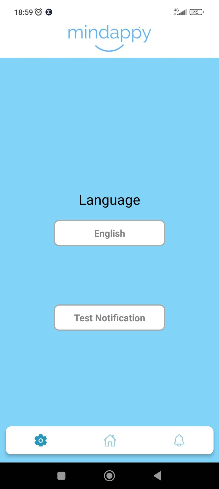
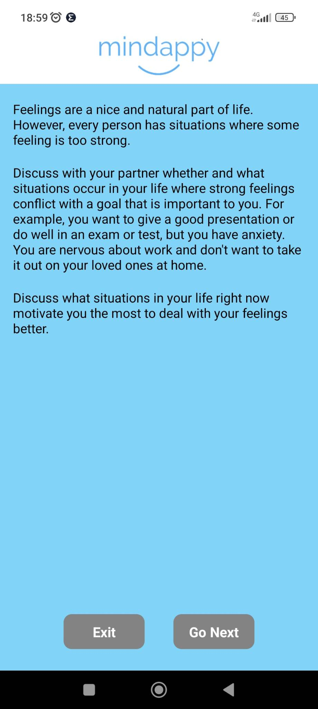

# Project Name: Mindappy
### Author: Hans-Märten Liiu
 

Main Idea:
-------------

Make a Social and Emotional learning application
 

 
The purpose of the application is to show people exercises that they have to go through in real life, and through these exercises it is possible for users to manage their emotions when necessary. The exercises and the original idea of the created application come from Liisa Ringo's master's thesis and Liisa Ringo's own experience working in this field.

 

## Application functional details
### Determining SE learning skill level
* Choose answers to questions from the drop-down menu
* Move to the next question by scrolling down
* Move to the previous question by scrolling up
* Submit answers for questions
### Exercises
* Show exercises
* Move to the next exercise
* Go to the previous exercise
* Finish doing exercises
### Notifications to start studying again
* Add a notification after 15 minutes
* Add notification after 1 hour
* Set a specific time to receive a notification the next day
### Settings
* It is possible to change the application language
* Text Notifications
### Displaying the learning result
* The user can display the results of his study on the graph

 

## How to boot the application
### For Android
* Download APK from link below and install it on your device
* https://drive.google.com/drive/folders/12bLIRf376BIuQ2EsjaIC95rRKIVLhXtq?usp=sharing

### For PC
* For boot, with CMD you have to move to Mindappy folder and type npx expo install then npm start

 

## Images of the application
* Start Page

 

* Home Menu

 

* Notification Menu

 

* Settings Menu

 

* Assessment Page

 

* Exercise Page

 

* Results Page

 

## Some images/icons taken from:
* https://www.npmjs.com/package/ionicons
